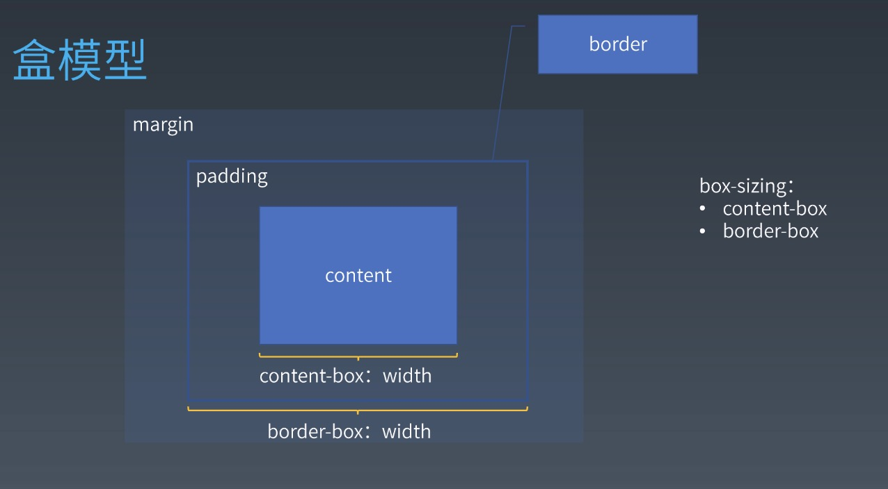
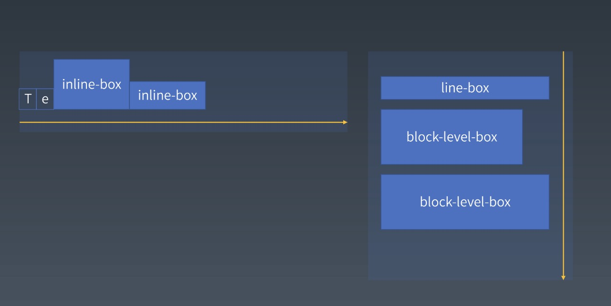

# 每周总结可以写在这里

## 选择器

### 选择器语法
- 简单选择器
    - \*
    - div svg|a(namespace 命名空间下的标签)
    - .cls
    - #id
    - [attr=value]
    - :hover
    - ::before

- 复合选择器
    - <简单选择器><简单选择器><简单选择器>
    - *或者div(typeSelector)必须写在最前面

- 复杂选择器
    - <复合选择器><'sp'><复合选择器>
    - <复合选择器>'>'<复合选择器>
    - <复合选择器>'~'<复合选择器>
    - <复合选择器>'+'<复合选择器>
    - <复合选择器>'||'<复合选择器>(table 里面选择一列)

- 选择器优先级
    - 简单选择器计数
    ```
        [行内样式，id，class，标签]
        属性选择器 与class选择器等效
        例如
        div#a.b .c[id=x] ([0,1,3,1])
        #a:not(#b)       ([0,2,0,0])
        *.a              ([0,0,1,0])
        div.a            ([0,0,1,1])
    ```

- 伪类
    - 链接/行为
        - :any-link
        - :link :visited
        - :hover
        - :active
        - :focus
        - :target(针对锚点链接)

    - 树结构
        - :empty
        - :nth-child()
        - :nth-last-child()
        - :first-child :last-child :only-child
    
    - 逻辑型
        - :not伪类
        - :where :has

- 伪元素
    - ::before
    - ::after
    - ::firstLine(针对排版的第一行)
        - 可用属性
        - font系列
        - color系列
        - background系列
        - word-spacing
        - letter-spacing
        - text-decoration
        - text-transform
        - line-height

    - ::firstLetter(针对内容的第一个字符)
        - 可用属性
        - font系列
        - color系列
        - background系列
        - word-spacing
        - letter-spacing
        - text-decoration
        - text-transform
        - line-height
        - float
        - vertical-align
        - 盒模型系列:margin padding border


### 排版

#### 盒
    为了展现一个元素，在界面上产生的一块长方形的区域，包含内容，边距，边框等

####  盒模型


#### 正常流

##### 正常流排版
- 收集盒进行
- 计算盒在行中的排布
- 计算行的排布
- inline formatting content (IFC)(下图左)
- block formatting content (BFC)(下图右)


##### float与clear

##### margin折叠

    margin折叠只会发生在同一个BFC中的主轴方向的子元素之间
    block-level 表示可以被放入BFC
    block-container 表示可以容纳BFC
    block-box=block-level+block-container
    block 如果overflow是visible 那么就跟父BFC合并
